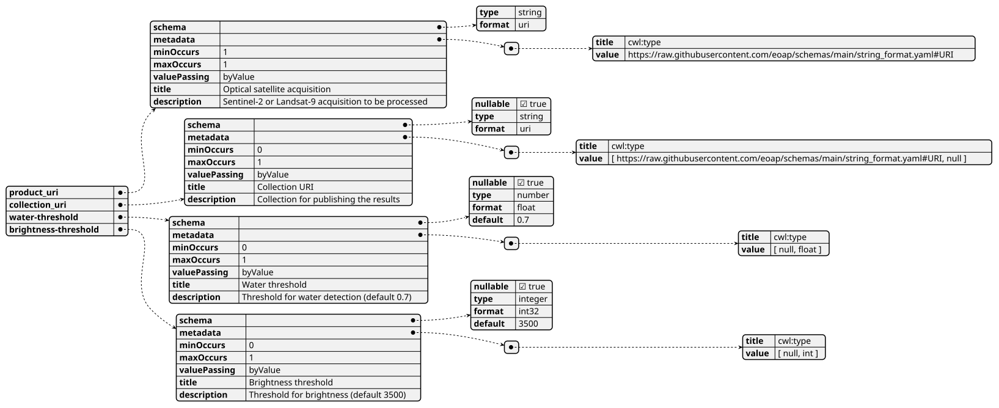
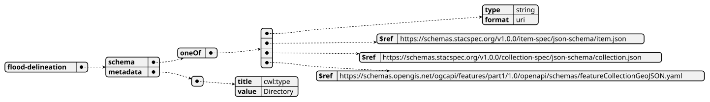
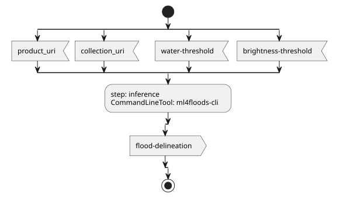
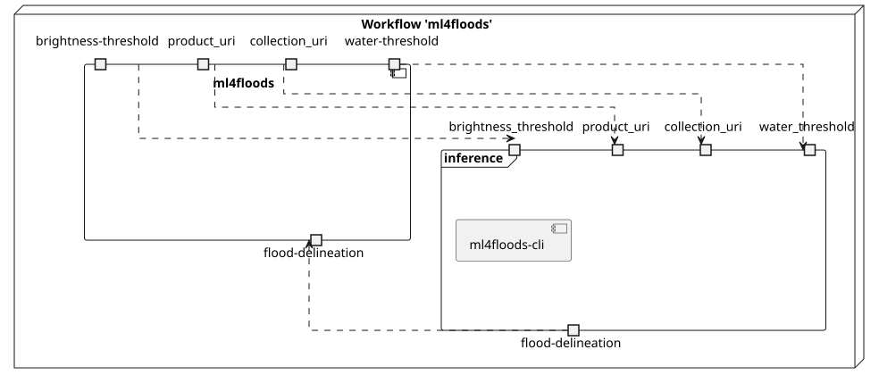
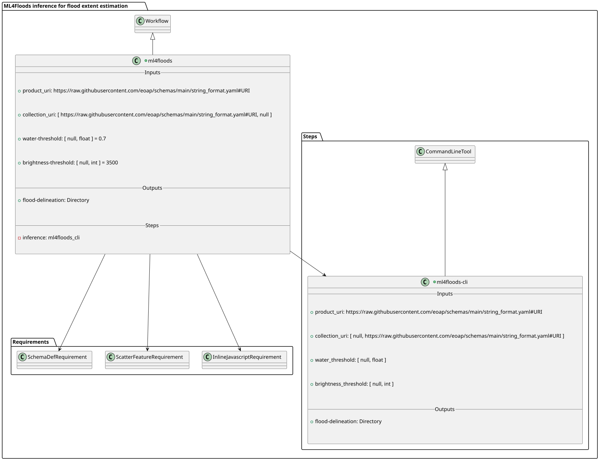
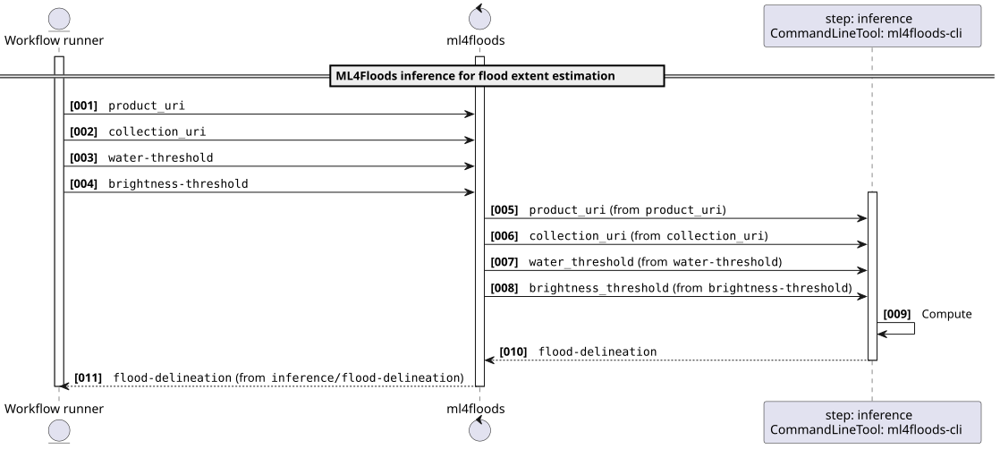
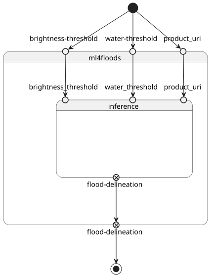

# ML4Floods inference for flood extent estimation using pre-trained model on Sentinel-2 or Landsat-9 data v0.3.5

ML4Floods is an end-to-end ML pipeline for flood extent estimation using optical satellite data from Sentinel-2 or Landsat-8/9 acquisition

> This software is licensed under the terms of the [Creative Commons Attribution 4.0 International](https://creativecommons.org/licenses/by/4.0/legalcode) license - SPDX short identifier: [CC-BY-4.0](https://spdx.org/licenses/CC-BY-4.0)
>
> 2025-10-29 - 2026-04-10T11:41:48.728 Copyright [Terradue Srl](mailto:info@terradue.com) - > [https://ror.org/0069cx113](https://ror.org/0069cx113)

## Project Team

### Authors

| Name | Email | Organization | Role | Identifier |
|------|-------|--------------|------|------------|
| Brito, Fabrice | [fabrice.brito@terradue.com](mailto:fabrice.brito@terradue.com) | [Terradue](https://ror.org/0069cx113) | [Project Manager](http://purl.org/spar/datacite/ProjectManager) | [https://orcid.org/0009-0000-1342-9736](https://orcid.org/0009-0000-1342-9736) |
| Re, Alice | [alice.re@terradue.com](mailto:alice.re@terradue.com) | [Terradue](https://ror.org/0069cx113) | [Researcher](http://purl.org/spar/datacite/Researcher) | [https://orcid.org/0000-0001-7068-5533](https://orcid.org/0000-0001-7068-5533) |
| Tripodi, Simone | [simone.tripodi@terradue.com](mailto:simone.tripodi@terradue.com) | [Terradue](https://ror.org/0069cx113) | [Project Leader](http://purl.org/spar/datacite/ProjectLeader) | [https://orcid.org/0009-0006-2063-618X](https://orcid.org/0009-0006-2063-618X) |


### Contributors

| Name | Email | Organization | Role | Identifier |
|------|-------|--------------|------|------------|
| Vaccari, Simone | [simone.vaccari@terradue.com](mailto:simone.vaccari@terradue.com) | [Terradue](https://ror.org/0069cx113) | [Researcher](http://purl.org/spar/datacite/Researcher) | [https://orcid.org/0000-0002-2757-4165](https://orcid.org/0000-0002-2757-4165) |


## User Manual

User Manual can be found on [https://eoap.github.io/app-ml4floods/](https://eoap.github.io/app-ml4floods/).


## Runtime environment

### Supported Operating Systems

- Linux
- MacOS X

### Requirements

- [https://cwltool.readthedocs.io/en/latest/](https://cwltool.readthedocs.io/en/latest/)
- [https://www.python.org/](https://www.python.org/)


## Software Source code

- Browsable version of the [source repository](https://github.com/eoap/app-ml4floods.git);
- [Continuous integration](https://github.com/eoap/app-ml4floods/actions) system used by the project;
- Issues, bugs, and feature requests should be submitted to the following [issue management](https://github.com/eoap/app-ml4floods/issues) system for this project


---


## ml4floods

### CWL Class

[Workflow](https://www.commonwl.org/v1.2/Workflow.html#Workflow)

### Requirements

* [InlineJavascriptRequirement](https://www.commonwl.org/v1.2/Workflow.html#InlineJavascriptRequirement)
* [ScatterFeatureRequirement](https://www.commonwl.org/v1.2/Workflow.html#ScatterFeatureRequirement)
* [SchemaDefRequirement](https://www.commonwl.org/v1.2/Workflow.html#SchemaDefRequirement)

### Inputs

| Id | Type | Label | Doc |
|----|------|-------|-----|
| `product_uri` | [URI](https://raw.githubusercontent.com/eoap/schemas/main/string_format.yaml#URI):<ul><li>`value`: [string](https://www.commonwl.org/v1.2/Workflow.html#CWLType)</li></ul> | Optical satellite acquisition | Sentinel-2 or Landsat-9 acquisition to be processed |
| `collection_uri` | One of:<ul><li>[URI](https://raw.githubusercontent.com/eoap/schemas/main/string_format.yaml#URI):<ul><li>`value`: [string](https://www.commonwl.org/v1.2/Workflow.html#CWLType)</li></ul></li><li>[null](https://www.commonwl.org/v1.2/Workflow.html#CWLType)</li></ul> | Collection URI | Collection for publishing the results |
| `water-threshold` | One of:<ul><li>[null](https://www.commonwl.org/v1.2/Workflow.html#CWLType)</li><li>[float](https://www.commonwl.org/v1.2/Workflow.html#CWLType)</li></ul> | Water threshold | Threshold for water detection (default 0.7) |
| `brightness-threshold` | One of:<ul><li>[null](https://www.commonwl.org/v1.2/Workflow.html#CWLType)</li><li>[int](https://www.commonwl.org/v1.2/Workflow.html#CWLType)</li></ul> | Brightness threshold | Threshold for brightness (default 3500) |


### Steps

| Id | Runs | Label | Doc |
|----|------|-------|-----|
| [inference](#ml4floods-cli) | `#ml4floods-cli` | None | None |


### Outputs

| Id | Type | Label | Doc |
|----|------|-------|-----|
| `flood-delineation` | [Directory](https://www.commonwl.org/v1.2/Workflow.html#Directory) | None | None |


### OGC API - Processes

When `ml4floods` [Workflow](https://www.commonwl.org/v1.2/Workflow.html#Workflow) is exposed through [OGC API - Processes - Part 1: Core](https://docs.ogc.org/is/18-062r2/18-062r2.html), `inputs` and `outputs` fields below represent the interface of the [getProcessDescription](https://developer.ogc.org/api/processes/index.html#tag/ProcessDescription/operation/getProcessDescription) API. 


#### Inputs



#### Outputs




### UML Diagrams


#### Activity diagram

Learn more about the [Activity diagram](https://en.wikipedia.org/wiki/Activity_diagram) below.



#### Component diagram

Learn more about the [Component diagram](https://en.wikipedia.org/wiki/Component_diagram) below.



#### Class diagram

Learn more about the [Class diagram](https://en.wikipedia.org/wiki/Class_diagram) below.



#### Sequence diagram

Learn more about the [Sequence diagram](https://en.wikipedia.org/wiki/Sequence_diagram) below.



#### State diagram

Learn more about the [State diagram](https://en.wikipedia.org/wiki/State_diagram) below.




### Run in step

`inference`


## ml4floods-cli

### CWL Class

[CommandLineTool](https://www.commonwl.org/v1.2/CommandLineTool.html#CommandLineTool)

### Inputs

| Id | Option | Type |
|----|------|-------|
| `product_uri` | `--product-uri` | [URI](https://raw.githubusercontent.com/eoap/schemas/main/string_format.yaml#URI):<ul><li>`value`: [string](https://www.commonwl.org/v1.2/Workflow.html#CWLType)</li></ul> |
| `collection_uri` | `--collection_uri` | One of:<ul><li>[null](https://www.commonwl.org/v1.2/Workflow.html#CWLType)</li><li>[URI](https://raw.githubusercontent.com/eoap/schemas/main/string_format.yaml#URI):<ul><li>`value`: [string](https://www.commonwl.org/v1.2/Workflow.html#CWLType)</li></ul></li></ul> |
| `water_threshold` | `--water-threshold` | One of:<ul><li>[null](https://www.commonwl.org/v1.2/Workflow.html#CWLType)</li><li>[float](https://www.commonwl.org/v1.2/Workflow.html#CWLType)</li></ul> |
| `brightness_threshold` | `--brightness-threshold` | One of:<ul><li>[null](https://www.commonwl.org/v1.2/Workflow.html#CWLType)</li><li>[int](https://www.commonwl.org/v1.2/Workflow.html#CWLType)</li></ul> |

### Execution usage example:

```
ml4floods-cli <ARGUMENT_DYNAMICALLY_SET> \
--product-uri <PRODUCT_URI> \
(--collection_uri <COLLECTION_URI>) \
(--water-threshold <WATER_THRESHOLD>) \
(--brightness-threshold <BRIGHTNESS_THRESHOLD>)
```

